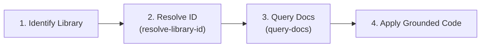

# Context7 Documentation & API Research Skill

This skill provides a systematic protocol to query, verify, and apply live, version-specific documentation and code examples via Context7 MCP.

---

## When to Use

- **Library & Framework APIs**: Implementing components, hooks, utilities, or endpoints with external libraries.
- **Breaking Changes & Version Specifics**: Verifying syntax for Next.js App Router, React 19, Three.js WebGPU, Drizzle ORM, Zod, or GSAP.
- **Config & Tooling**: Writing config files (`next.config.ts`, `drizzle.config.ts`, `tailwind.config.ts`, etc.).
- **Debugging Library Errors**: Investigating runtime errors, deprecation warnings, or type mismatches from third-party packages.

> [!IMPORTANT]
> Always ground implementation decisions in official documentation from Context7 rather than relying on stale model training data or assumptions.

---

## Standard 3-Step Protocol

### Step 1: Resolve Library ID

Unless using a known pre-mapped ID (see [Stack Library Reference](./references/stack-libraries.md)), always resolve the package ID first.

1. Call `resolve-library-id`:
   - `libraryName`: Official package name with proper capitalization (e.g., `Next.js`, `Three.js`, `Drizzle ORM`, `Zod`).
   - `query`: The specific technical goal or concept being researched.
2. Select the best match based on:
   - **ID Format**: `/org/project` (or `/org/project/version` if targeting a specific release)
   - **Reputation**: High or Medium preferred
   - **Snippet Coverage**: High snippet count
   - **Benchmark Score**: Highest score available

### Step 2: Query Documentation (Scoped)

Execute targeted queries against the resolved `libraryId`.

1. Call `query-docs`:
   - `libraryId`: The resolved ID (e.g., `/vercel/next.js`, `/drizzle-team/drizzle-orm`)
   - `query`: Specific, detailed question focused on **one single concept** at a time.
2. **Query Scoping Rules**:
   - ✅ **Good**: `"How to configure WebGPURenderer with WebGL fallback in Three.js"`
   - ✅ **Good**: `"How to define relational queries and migrations in Drizzle ORM with Neon PostgreSQL"`
   - ❌ **Avoid broad mashups**: `"Next.js Three.js Drizzle Zod setup"` (Combined queries dilute search ranking).

### Step 3: Synthesize & Implement

1. Extract exact types, method signatures, config options, and modern idioms.
2. Verify TypeScript type safety and compatibility with React 19 / Next.js 15.
3. Reference official sources when documenting architectural decisions.

---

## Pre-Mapped Project Stack Quick Reference

| Library               | Primary Use                               | Context7 Library ID         |
| :-------------------- | :---------------------------------------- | :-------------------------- |
| **Next.js**           | App Framework, Routing, Server Components | `/vercel/next.js`           |
| **React**             | Core UI & Hooks                           | `/facebook/react`           |
| **Three.js**          | WebGPU/WebGL 3D Engine                    | `/mrdoob/three.js`          |
| **React Three Fiber** | Declarative 3D in React                   | `/pmndrs/react-three-fiber` |
| **Drei**              | R3F Helper Primitives                     | `/pmndrs/drei`              |
| **Drizzle ORM**       | PostgreSQL Type-Safe ORM                  | `/drizzle-team/drizzle-orm` |
| **Neon**              | Serverless PostgreSQL Driver              | `/neondatabase/serverless`  |
| **Zod**               | Schema Validation & Type Inference        | `/colinhacks/zod`           |
| **GSAP**              | Motion & ScrollTrigger Animations         | `/greensock/gsap`           |
| **Tailwind CSS**      | Styling System                            | `/tailwindlabs/tailwindcss` |

For advanced query recipes and deep-dive documentation on these libraries, see [Stack Libraries Cheatsheet](./references/stack-libraries.md).
