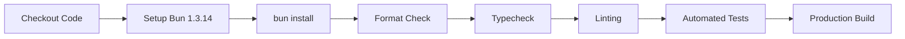

# CI Quality Gate & Automated Verification

This document outlines the Continuous Integration (CI) quality gate architecture for the **CodeGrogu Portfolio** (`CodeGrogu/portfolio`).

---

## 1. Overview & Workflow Triggers

The CI pipeline is defined in [`.github/workflows/ci.yml`](file:///.github/workflows/ci.yml) and executes on:

- Every **Pull Request** targeting `main`.
- Every direct **Push** or **Merge** to `main`.

---

## 2. Pipeline Quality Gates (Sequential Execution)

The workflow provisions an `ubuntu-latest` runner with Bun `1.3.14` and runs the complete 5-stage verification suite:

1. **Dependency Installation (`bun install`)**:
   - Resolves and installs all direct and peer dependencies via Bun's high-speed package engine.

2. **Formatting Gate (`bun run format:check`)**:
   - Executes Prettier with `prettier-plugin-tailwindcss` to enforce consistent code style and class sorting across the repository.

3. **Type Safety Gate (`bun run typecheck`)**:
   - Runs `tsc --noEmit` under strict TypeScript rules (`strict: true`, `noImplicitAny: true`, `noUncheckedIndexedAccess: true`).

4. **Linting Gate (`bun run lint`)**:
   - Runs ESLint with Next.js Core Web Vitals and TypeScript rules with 0 permitted errors or warnings.

5. **Test Suite Gate (`bun test`)**:
   - Executes unit and integration test suites using Bun's native test runner.

6. **Production Build Gate (`bun run build`)**:
   - Compiles and bundles Next.js 16 with Turbopack, validating tree-shaking, static route generation, and zero bundle errors.

---

## 3. Branch Protection & Quality Invariant

- **Target Branch**: `main`
- **Merge Requirements**:
  - Pull Request required.
  - CI workflow (`Baseline Verification (Bun)`) must pass with green status.
  - Zero failing checks or unresolved discussions.
